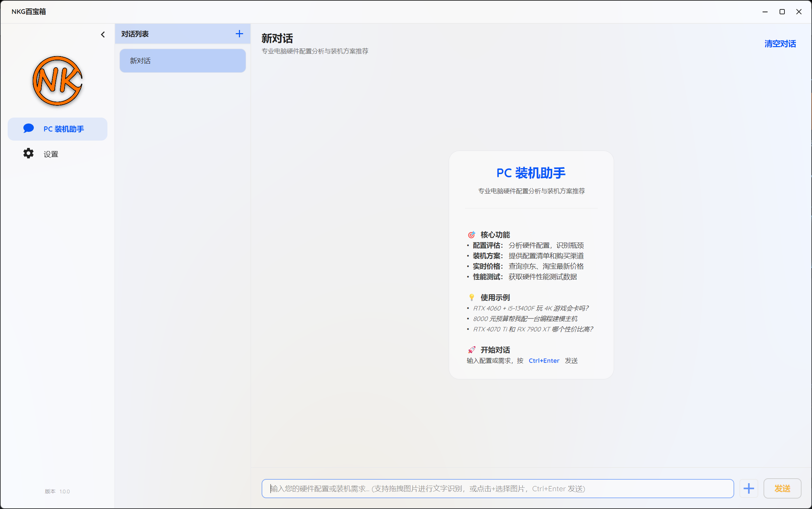
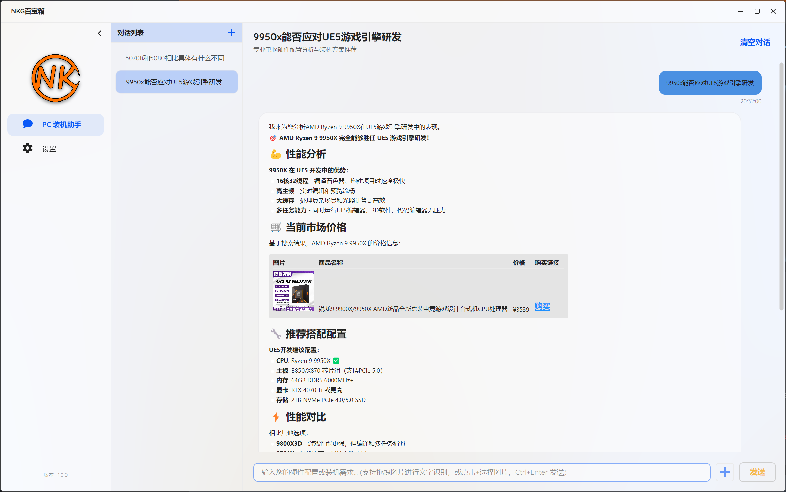
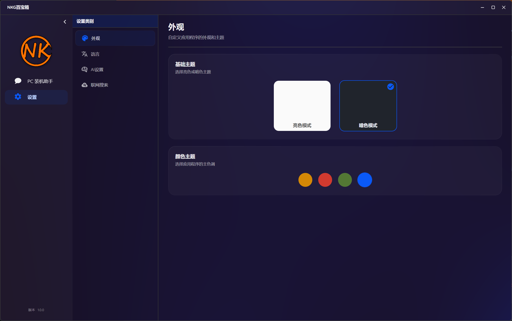
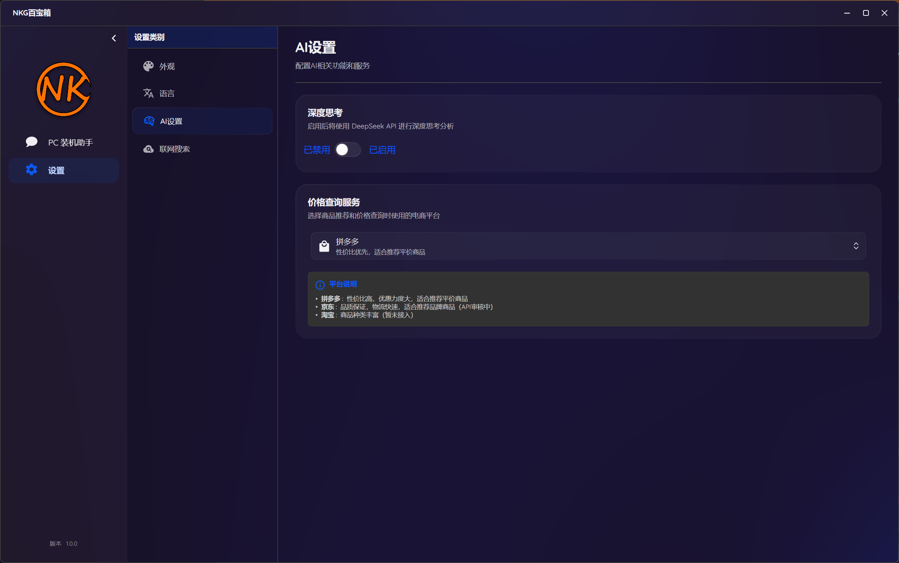

# AI Computer

<div align="center">


**一款基于 Avalonia 的跨平台 AI 智能助手桌面应用**

[](https://dotnet.microsoft.com/)
[](https://avaloniaui.net/)
[](LICENSE)

</div>

---

## 📸 应用截图

<div align="center">

### 主界面


### 多会话对话


### 智能搜索


### 设置界面


</div>

## 🎥 演示视频

[查看演示视频](Assets/2025-10-29_13-04-17.mp4)

---

## ✨ 功能特性

### 🤖 智能对话系统
- **AI 智能助手**：集成 DeepSeek AI 模型，提供流畅的对话体验
- **深度思考模式**：启用推理模型（Reasoning Model），让 AI 进行深度分析和推理
- **多会话管理**：支持创建、切换、重命名和删除多个独立对话会话
- **流式响应**：实时显示 AI 生成的内容，提供即时反馈
- **会话自动保存**：对话内容自动保存到本地，应用重启后可恢复

### 🔍 智能搜索
- **多引擎支持**：
  - 百度搜索：国内主流搜索引擎
  - Bing 搜索：国际化搜索体验
  - SearxNG：开源隐私保护元搜索引擎（支持实例测试和切换）
- **混合搜索策略**：优先使用浏览器搜索，失败后自动降级到 SearxNG
- **搜索结果整合**：AI 自动分析搜索结果并给出综合回答

### 🛒 商品推荐与返利
- **电商平台集成**：
  - 京东联盟：提供京东商品推广链接
  - 拼多多联盟：提供拼多多商品推广链接
  - 淘宝联盟：（规划中）
- **智能推荐**：根据用户需求自动搜索并推荐相关商品
- **价格对比**：展示商品价格、优惠券信息和推广链接
- **返利赚取**：通过推广链接购买可获得佣金

### 🖼️ 图片识别（OCR）
- **拖拽识别**：支持拖拽图片到输入框进行 OCR 识别
- **粘贴识别**：支持粘贴剪贴板中的图片进行识别
- **文件选择**：支持通过文件选择器选择图片
- **自动识别**：图片内容自动转换为文本，便于 AI 理解和处理
- **本地处理**：使用 ONNX Runtime 本地 OCR 模型，保护隐私

### 🎨 界面与体验
- **现代化 UI**：基于 SukiUI 设计，界面美观简洁
- **主题切换**：支持亮色/暗色主题切换，以及多种颜色主题
- **Markdown 渲染**：聊天消息支持 Markdown 格式，代码高亮显示
- **自动滚动**：消息自动滚动到底部，用户手动滚动时智能暂停
- **响应式布局**：界面自适应不同窗口大小

### 🌍 多语言支持
- **中文**：简体中文界面
- **English**：英文界面
- **动态切换**：运行时切换语言，无需重启应用

---

## 🛠️ 技术栈

### 前端框架
- **Avalonia 11.3.6**：跨平台 XAML UI 框架
- **SukiUI 6.0.4**：现代化 UI 组件库
- **IconPacks.Avalonia 1.2.0**：丰富的图标库

### 开发框架
- **.NET 9.0**：最新的 .NET 运行时
- **C# 13**：现代化的 C# 语言特性

### MVVM 架构
- **CommunityToolkit.Mvvm 8.2.1**：MVVM 辅助工具包
- **ReactiveUI**：响应式编程支持

### AI 与 NLP
- **DeepSeek API**：强大的对话式 AI 模型
- **Microsoft.ML.OnnxRuntime 1.23.1**：OCR 模型推理

### 计算机视觉
- **Emgu.CV 4.12.0**：OpenCV .NET 封装，用于图像处理

### 网络与爬虫
- **PuppeteerSharp 20.2.4**：浏览器自动化，用于网络搜索
- **HttpClient**：HTTP 请求处理

### 其他
- **LiveMarkdown.Avalonia 1.3.5**：Markdown 渲染
- **YamlDotNet 16.3.0**：YAML 配置文件解析

---

## 📦 安装与使用

### 系统要求
- **操作系统**：Windows 10/11（x64）
- **运行时**：.NET 9.0 Runtime（自包含版本无需安装）

### 安装步骤

#### 方式一：直接下载可执行文件（推荐）
1. 从 [Releases](https://github.com/yourusername/ai-computer/releases) 页面下载最新版本
2. 解压到任意目录
3. 双击 `AiComputer.exe` 运行

#### 方式二：从源码编译
1. 克隆仓库
   ```bash
   git clone https://github.com/yourusername/ai-computer.git
   cd ai-computer
   ```

2. 安装 .NET 9.0 SDK
   ```bash
   # 从官网下载安装：https://dotnet.microsoft.com/download/dotnet/9.0
   ```

3. 编译项目
   ```bash
   dotnet build
   ```

4. 运行项目
   ```bash
   dotnet run
   ```

### 首次使用
1. 启动应用后，首次使用会显示欢迎界面
2. 在设置中配置搜索引擎（可选）
3. 选择电商平台（京东或拼多多）
4. 开始与 AI 对话

---

## 🚀 使用指南

### 基本对话
- 在输入框中输入消息，按 `Enter` 或点击发送按钮
- AI 会流式响应，实时显示生成的内容
- 点击"停止"按钮可中断 AI 生成

### 多会话管理
- 点击侧边栏的 `+` 按钮创建新会话
- 点击会话名称切换到该会话
- 右键点击会话名称可重命名或删除

### 启用深度思考
- 进入设置 → AI 设置
- 开启"深度思考模式"
- AI 会在回答前进行深度推理（显示思考过程）

### 网络搜索
- 直接询问需要搜索的问题（如"最新的科技新闻"）
- AI 会自动调用搜索工具
- 搜索结果会以卡片形式展示，可展开/收起查看详情

### 商品推荐
- 询问商品相关问题（如"推荐一款性价比高的笔记本"）
- AI 会自动调用商品推荐工具
- 展示商品名称、价格和推广链接
- 点击链接购买可支持项目发展

### 图片识别
- **拖拽**：将图片文件拖拽到输入框
- **粘贴**：复制图片后在输入框按 `Ctrl+V`
- **选择**：点击输入框旁边的图片按钮选择文件
- 图片内容会自动识别为文本，AI 可理解图片内容

### 主题切换
- 进入设置 → 外观
- 切换亮色/暗色主题
- 选择喜欢的颜色主题

### 语言切换
- 进入设置 → 语言
- 选择中文或英文
- 界面立即切换语言

---

## 📂 项目结构

```
ai-computer/
├── Models/              # 数据模型
├── ViewModels/          # 视图模型（MVVM）
├── Views/               # 视图（XAML）
├── Services/            # 业务逻辑服务
│   ├── DeepSeekService.cs          # AI 对话服务
│   ├── HybridSearchService.cs      # 混合搜索服务
│   ├── JDGoodsRecommendService.cs  # 京东商品推荐
│   ├── PDDGoodsRecommendService.cs # 拼多多商品推荐
│   ├── OcrService.cs               # OCR 识别服务
│   └── ...
├── Assets/              # 静态资源
│   ├── chrome-win64/    # Chrome 浏览器（用于搜索）
│   └── OCRModels/       # OCR 模型文件
├── App.axaml            # 应用程序 XAML
├── App.axaml.cs         # 应用程序逻辑
├── Program.cs           # 程序入口
└── README.md            # 项目说明
```

---

## 🔧 配置说明

### 应用配置文件
配置文件保存在 `%AppData%/AiComputer/settings.json`

```json
{
  "Language": "zh-CN",              // 语言设置
  "SearchProvider": "Bing",         // 搜索引擎
  "ECommerceProvider": "JingDong",  // 电商平台
  "EnableDeepThinking": false       // 是否启用深度思考
}
```

### 会话存档
对话会话保存在 `%AppData%/AiComputer/chat_sessions.json`

---

## ❓ 常见问题

### Q: 如何更换搜索引擎？
A: 进入设置 → 联网搜索，选择百度、Bing 或 SearxNG。

### Q: 深度思考模式有什么用？
A: 启用后，AI 会在回答前进行深度推理，给出更准确的答案（但速度会稍慢）。

### Q: 如何切换电商平台？
A: 进入设置 → AI 设置，选择京东或拼多多。

### Q: OCR 识别不准确怎么办？
A: OCR 基于本地模型，识别率取决于图片质量。请确保图片清晰、文字大小合适。

### Q: 应用启动慢怎么办？
A: 首次启动会初始化 Chrome 浏览器和 OCR 模型，需要一定时间。后续启动会更快。

---

## 📄 许可证

本项目采用 [MIT License](LICENSE) 开源协议。

---

## 🙏 致谢

感谢以下开源项目：
- [Avalonia](https://avaloniaui.net/)
- [SukiUI](https://github.com/kikipoulet/SukiUI)
- [DeepSeek](https://www.deepseek.com/)
- [PuppeteerSharp](https://www.puppeteersharp.com/)
- [Emgu CV](https://www.emgu.com/)

---

## 📧 联系方式

如有问题或建议，欢迎通过以下方式联系：
- GitHub Issues：[提交问题](https://github.com/yourusername/ai-computer/issues)
- Email：your.email@example.com

---

<div align="center">

**如果觉得项目不错，请给个 ⭐ Star 支持一下！**

</div>
